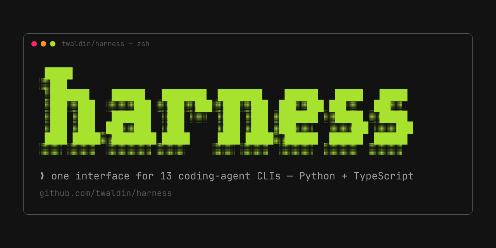

# harness



One CLI (and one Python API, and one TypeScript API) to invoke every headless coding-CLI agent as a subprocess. `claude-code`, `openclaude`, `opencode`, `codex`, `gemini`, `aider`, `swe-agent`, `qwen`, `continue-cli`, `pi`, `factory-droid`, `kilo`, `crush` — one `RunSpec`, one `RunResult`, zero per-CLI adapter code in your project.

## Quick start

**Python** — `pip install harness-cli` (imports as `harness`; `harness` was squatted on PyPI)

```python
from harness import RunSpec, run

r = run(RunSpec(
    harness="claude-code",
    model="sonnet",
    prompt="Write a one-line Python hello-world.",
    workdir="/tmp/scratch",
))
print(f"exit={r.exit_code}  cost=${r.cost_usd:.4f}  tokens={r.tokens_in}/{r.tokens_out}")
```

**TypeScript** — `npm install @twaldin/harness-ts`

```typescript
import { run } from '@twaldin/harness-ts'

const r = await run({
  harness: 'claude-code',
  model: 'sonnet',
  prompt: 'Write a one-line TypeScript hello-world.',
  workdir: '/tmp/scratch',
})
console.log(`exit=${r.exitCode}  cost=$${r.costUsd?.toFixed(4)}  tokens=${r.tokensIn}/${r.tokensOut}`)
```

See [`examples/hello-world.py`](examples/hello-world.py) and [`ts/examples/hello-world.ts`](ts/examples/hello-world.ts) for runnable versions.

---

## Who should use this

You're building any of these:

- An **eval framework** or **benchmark harness** that needs to invoke multiple CLI agents headlessly and capture cost + tokens uniformly. (See [agentelo](https://github.com/twaldin/agentelo).)
- A **prompt optimizer** that needs to run the same task against claude-code, gemini, and opencode and compare results without writing six subprocess wrappers. (See [hone](https://github.com/twaldin/hone).)
- A **coding orchestrator** that spawns agents as subprocesses, injects system prompts, and needs to swap the underlying model without touching call sites.
- An **interactive CLI wrapper** (like [flt](https://github.com/twaldin/flt)) that needs command construction (`buildCommand()`) without the subprocess execution.
- Anything that would otherwise make you write "if harness == 'claude': ... elif harness == 'gemini': ..." in multiple places.

If you're writing per-CLI subprocess plumbing from scratch, this library has already done it.

---

## Why

I wrote per-CLI spawn / env / output-parsing logic three separate times across three projects:

- [`flt`](https://github.com/twaldin/flt) — TS adapters in `src/adapters/{claude-code,opencode,codex,gemini,aider,swe-agent}.ts`. Each one knew how to launch its CLI in tmux, strip ANSI, detect a ready prompt, send keys to approve dialogs.
- [`agentelo`](https://github.com/twaldin/agentelo) — `bin/agentelo` (1847 lines of Node) with ~800 lines of `if (harness === 'X')` blocks. Per-CLI argv, env setup (Vertex tokens, GCloud, OpenAI proxy), inactivity watchdogs, six different token/cost parsers (claude's JSON envelope, codex's JSONL turn events, gemini's `stats.models`, opencode's session sqlite, aider's "Tokens: N sent" scrape, swe-agent's trajectory file).
- [`hone`](https://github.com/twaldin/hone) — `src/hone/mutators/claude_code.py`, then almost the same logic again for an `anthropic_api.py` mutator, then a `custom_script.py` shape, with the JSON parsing rewritten each time.

Three implementations, three sets of bugs, knowledge gained in one project never crossed to the others. When `opencode` changed its session DB schema, only agentelo learned. When `claude --output-format json` added a `cache_creation_input_tokens` field that mattered for accurate cost, only hone fixed it.

`harness` is the deduped version. Each CLI's quirks live in exactly one adapter file, all thirteen adapters share the same `RunSpec → RunResult` contract, and the next consumer (TS or Python) shells out to `harness run --json` instead of starting from scratch.

---

## Examples by problem

### "Run an agent, capture cost + tokens"

```python
from pathlib import Path
from harness import RunSpec, run

result = run(RunSpec(
    harness="claude-code",
    model="sonnet",
    prompt="Fix the failing tests in this repo and report what you changed.",
    workdir=Path("/tmp/my-bug-fix-checkout"),
    timeout_seconds=1800,
))

print(f"exit={result.exit_code} cost=${result.cost_usd:.4f} "
      f"tokens={result.tokens_in}/{result.tokens_out} "
      f"wall={result.duration_seconds:.1f}s")
```

### "Swap models without rewriting call sites"

```python
for spec in [
    RunSpec(harness="claude-code", model="sonnet",          prompt=task, workdir=wd),
    RunSpec(harness="opencode",    model="gpt-5.4",         prompt=task, workdir=wd),
    RunSpec(harness="gemini",      model="gemini-2.5-pro",  prompt=task, workdir=wd),
]:
    r = run(spec)
    print(f"{spec.harness:12} {spec.model:25} ${r.cost_usd or 0:.4f}")
```

Canonical model names like `gpt-5.4` are normalized per harness at command-build time. Provider-prefixed forms are added where required (for example `opencode -> openai/gpt-5.4`, `pi -> openai-codex/gpt-5.4`) and stripped for CLIs that expect bare model IDs.

Resolution is intentionally best-effort, not a full provider registry. If a model/provider/harness combo resolves incorrectly for your setup, please send a small PR. These fixes should stay easy to review and easy to merge.

### "Inject a system prompt / agent guide"

```python
result = run(RunSpec(
    harness="opencode",
    model="gpt-5.4",
    prompt="Fix the failing test described in the issue.",
    workdir=Path("/tmp/repo"),
    instructions="""You are an autonomous bug-fixing agent. No human will respond.
Run the failing tests, identify the root cause, fix the source (not the tests),
verify, then stop. Make the smallest possible change.""",
    timeout_seconds=1800,
))
```

`instructions` is written to the per-harness config file in `workdir` (`CLAUDE.md` for claude-code/openclaude, `AGENTS.md` for opencode/codex/pi/factory-droid/crush/kilo, `GEMINI.md` for gemini, `QWEN.md` for qwen, `CONTINUE.md` for continue-cli, `.aider.conf.yml` for aider). Filenames are baked into each adapter.

### "Use from TypeScript — command construction only (no subprocess)"

```typescript
import { buildCommand } from '@twaldin/harness-ts'

const { cmd, args, cwd, env, instructionsFile } = buildCommand({
  harness: 'claude-code',
  model: 'sonnet',
  prompt: 'Fix the failing tests.',
  workdir: '/tmp/repo',
  instructions: 'You are a careful engineer.',
})
// hand off to tmux, a process manager, or spawnSync
```

### "Use it as a hone mutator"

```bash
hone run prompt.md \
    --grader ./grade.sh \
    --mutator harness:claude-code:sonnet \
    --budget 20
```

---

## Install

### Python

```bash
pip install harness-cli
```

The PyPI name is `harness-cli` (`harness` was squatted). The Python import is `from harness import ...`.

For dev work:

```bash
git clone https://github.com/twaldin/harness
cd harness
pip install -e ".[dev]"
```

### TypeScript

```bash
npm install @twaldin/harness-ts
# or: bun add @twaldin/harness-ts
```

See [`ts/README.md`](ts/README.md) for full TypeScript docs.

---

## CLI use

```bash
harness list
harness run --harness opencode --model gpt-5.4 \
    --workdir /tmp/repo --instructions /tmp/agents.md \
    --timeout 1800 \
    "Fix the failing tests."

# bypass normalization and pass the model string through exactly as given
harness run --harness pi --model openai-codex/gpt-5.4 --model-no-resolve \
    --workdir /tmp/repo \
    "Fix the failing tests."
```

Add `--json` to emit a structured RunResult on stdout:

```json
{
  "harness": "opencode",
  "model": "gpt-5.4",
  "exit_code": 0,
  "duration_seconds": 47.2,
  "cost_usd": 0.0821,
  "tokens_in": 4201,
  "tokens_out": 887,
  "timed_out": false,
  "stdout": "...",
  "stderr": ""
}
```

---

## Adapter contract

Each adapter:

1. Writes `spec.instructions` to its known filename in `spec.workdir` (if provided).
2. Builds the CLI invocation for `spec.prompt` + `spec.model`.
3. Calls the shared subprocess runner (env merge, cwd, timeout, capture).
4. Parses any structured output the CLI emits and fills `RunResult.cost_usd` / `tokens_in` / `tokens_out` / `raw`.

See [ADAPTER-MATRIX.md](ADAPTER-MATRIX.md) for per-CLI flag details, cost-reporting quirks, and output shapes.

See [SPEC.md](SPEC.md) for the full `RunSpec` / `RunResult` schema and compatibility guarantees.

---

## Workdir / worktrees

`harness` does **not** create or manage git worktrees. `workdir` is opaque — pass any directory you've set up:

- a fresh `git clone` into a tmpdir
- a `git worktree add` path
- the user's existing checkout
- a Docker volume mount

The opt-in `--worktree` features in some CLIs (e.g. `claude --worktree`) are intentionally not wrapped — they pollute the project tree and reduce consumer flexibility.

---

## Used by

- [`hone`](https://github.com/twaldin/hone) — `harness:` mutator prefix routes prompt mutations through `harness.run()`.
- [`agentelo`](https://github.com/twaldin/agentelo) — migrating from ~800 lines of per-harness TS blocks to `harness run --json`.
- [`flt`](https://github.com/twaldin/flt) — uses `@twaldin/harness-ts` for CLI command construction; flt adds tmux lifecycle on top.

---

## Contributing

See [CONTRIBUTING.md](CONTRIBUTING.md) for code conventions and the "add an adapter" guide (~20 minutes).

Looking for a pre-scoped first PR? See [WANTED-ADAPTERS.md](WANTED-ADAPTERS.md). Each entry lists the CLI, adapter-to-copy-from, effort estimate, and the research already done.

---

## Status

v0.5 — thirteen adapters shipped: `claude-code`, `openclaude`, `opencode`, `codex`, `gemini`, `aider`, `swe-agent`, `qwen`, `continue-cli`, `pi`, `factory-droid`, `kilo`, `crush`.

### host Node version

This repo now includes `.nvmrc` pinned to Node `20.20.2` for interactive host usage:

```bash
cd ~/harness
nvm use
```

That helps for local dev and agent worktrees. In Docker / benchmark containers, prefer an explicit Node 20 install instead of relying on shell hooks.

### bringup helpers

Quick checks for the current gpt-5.4 harness set:

```bash
cd ~/harness
./scripts/check_binaries.sh
PYTHONPATH=src ./scripts/smoke_gpt54.py --timeout 90
```

The smoke runner asks each harness to write `hi` to `hi.txt` in cwd. If the file exists with the expected content, that harness is considered minimally alive for gpt-5.4 bringup.

### model resolution policy

The current resolution layer is deliberately rough:

- optimize for common cases like `gpt-5.4`
- keep harness-specific fixes tiny
- prefer explicit escape hatches over clever inference

If you need an exact raw model string, use `--model-no-resolve` (or `RunSpec(model_no_resolve=True)` in Python) and pass the provider/model form you want.

### Linux/container caveats (harness-bench)

- `openclaude`, `factory-droid`, and `kilo` are Node CLIs; use Node `>=20` in task containers.
- `kilo` and `crush` adapters force deterministic per-workdir sqlite locations (`<workdir>/.harness/...`) for container-safe metrics parsing.
- `kilo` and `crush` enforce strict same-model defaults (`model == small_model`) to avoid helper-model drift.
- `openclaude` adapter does not set `--fallback-model`; single-model runs are default.
- `factory-droid` adapter pins `--model` and `--spec-model` to the same value for fairness.

Pending:
- Per-harness inactivity watchdogs (port from `agentelo/bin/agentelo`).
- Vertex AI / GCloud token plumbing (currently consumer-supplied via `env`).
- Wire as the spawn backend for flt and agentelo (TS → Python subprocess boundary; design TBD).
